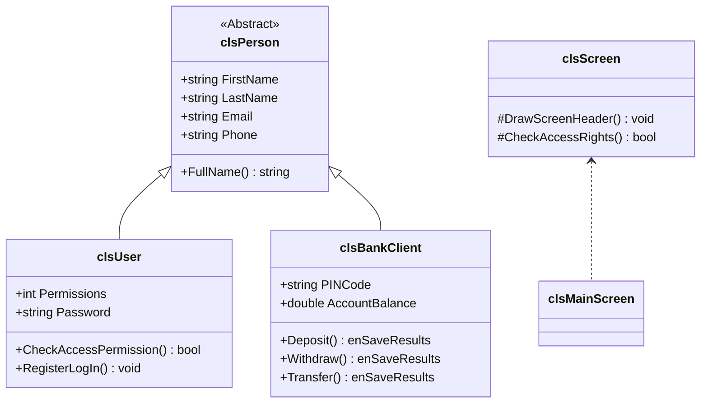

# Object-Oriented Bank & Currency Management System

[](https://en.cppreference.com/)
[](https://microsoft.com/)
[](https://visualstudio.microsoft.com/)
[](LICENSE)

A robust, console-based banking application engineered in **C++** utilizing advanced **Object-Oriented Programming (OOP)** architectures. The system provides a complete suite of services including client management, transactional processing (deposits, withdrawals, and multi-user transfers), a secure administrative control center with granular bitwise permission controls, login logging, and a real-time Currency Exchange system.

---

## 🔑 Core Features

1. **Client Management (CRUD)**: Create, read, update, and delete bank client accounts with secure fields like Account Numbers, PINs, and Balances.
2. **Transaction Suite**:
   - Safe deposits and withdrawals with real-time balance checks.
   - Secure inter-account transfer system.
   - Comprehensive audit logging recording time, accounts involved, amount, and the operator's Username.
3. **User & Security Access Control**:
   - Advanced bitwise flag-based permission mapping (9 distinct permissions: List Clients, Add User, Manage Currencies, etc.).
   - Caesar Cipher encryption (`Key = 5`) for passwords, PIN codes, and sensitive transaction parameters written to file databases.
   - Login register logging tracking logins, date/times, credentials, and access mask levels.
4. **Currency Exchange Engine**:
   - Live file-based database for global currencies.
   - Interactive currency rate updates.
   - Integrated Currency Exchange Calculator supporting cross-conversions via intermediate USD logic.

---

## 🏛️ Project Architecture & OOP Layout

The codebase strictly adheres to clean architectural principles, encapsulating UI presentation screens from business logic classes.



### Key Class Breakdown

* **Core Entities (Domain Model)**:
  * [clsPerson.h](file:///c:/Users/hp/source/repos/bank%20system/clsPerson.h): The abstract base class providing common personal attributes.
  * [clsBankClient.h](file:///c:/Users/hp/source/repos/bank%20system/clsBankClient.h): Derived from `clsPerson`. Contains state management and logical validation for clients.
  * [clsUser.h](file:///c:/Users/hp/source/repos/bank%20system/clsUser.h): Derived from `clsPerson`. Manages personnel, passwords, and bitwise access control.
  * [clsCurrency.h](file:///c:/Users/hp/source/repos/bank%20system/clsCurrency.h): Represents currency units, exchange rates, and parsing routines.
  * [clsTransactionLog.h](file:///c:/Users/hp/source/repos/bank%20system/clsTransactionLog.h): Encapsulates logging records for financial audit trails.

* **Presentation Layer (UI Screens)**:
  * [clsScreen.h](file:///c:/Users/hp/source/repos/bank%20system/clsScreen.h): The UI parent class enforcing standard headers and access verification.
  * [clsMainScreen.h](file:///c:/Users/hp/source/repos/bank%20system/clsMainScreen.h): Main menu routing for all bank screens.
  * [clsLoginScreen.h](file:///c:/Users/hp/source/repos/bank%20system/clsLoginScreen.h): Secure portal enforcing credential verification.
  * [clsCurrencyExchangeMainScreen.h](file:///c:/Users/hp/source/repos/bank%20system/clsCurrencyExchangeMainScreen.h): Operations manager for currency tasks.

* **Utility & Validation Layer**:
  * [clsInputValidate.h](file:///c:/Users/hp/source/repos/bank%20system/clsInputValidate.h): Handles console buffer errors, type conversions, and range boundary checking.
  * [clsUtil.h](file:///c:/Users/hp/source/repos/bank%20system/clsUtil.h): Encryption algorithms, random generators, and utility helpers.
  * [clsString.h](file:///c:/Users/hp/source/repos/bank%20system/clsString.h) & [clsDate.h](file:///c:/Users/hp/source/repos/bank%20system/clsDate.h): High-performance date arithmetic and string tokenizers.

---

## 📂 Project Directory Structure

```text
├── bank system.sln                  # MSVC Solution configuration file
├── bank system.vcxproj              # MSVC Project file containing references
├── bank system.vcxproj.filters      # Filter mapping for files within Visual Studio
│
├── bank system.cpp                  # Application entry point (main)
├── Global.h                         # Global state variables (e.g. CurrentUser)
│
├── Domain Model (C++ Header files)
│   ├── clsPerson.h                  # Abstract Base Class
│   ├── clsBankClient.h              # Client Business Logic
│   ├── clsUser.h                    # User Business Logic & Permissions
│   ├── clsCurrency.h                # Currency Exchange Engine
│   └── clsTransactionLog.h          # Transaction Log Audit Model
│
├── Presentation Screens
│   ├── clsScreen.h                  # Base UI Screen
│   ├── clsMainScreen.h              # Application Main Menu
│   ├── clsLoginScreen.h             # Login screen logic & lock-outs
│   ├── clsTransactionsScreen.h      # Financial menu
│   ├── clsManageUsers.h             # Administrative menu
│   ├── clsCurrencyExchangeMainScreen.h # Currency submenu
│   │
│   # Sub-screens & Dialogs
│   ├── clsListUsersScreen.h / clsAddNewUserScreen.h / clsDeletUserScreen.h ...
│   └── clsDepositScreen.h / clsWithdrawScreen.h / clsTransferScreen.h ...
│
├── Infrastructure / Utilities
│   ├── clsDate.h                    # Date calculation & formatting utils
│   ├── clsString.h                  # Tokenization, splitting and parsing utils
│   ├── clsUtil.h                    # Encryption (Caesar Cipher) & utility library
│   └── clsInputValidate.h           # Robust console input validator
│
├── Database Files (Flat-file Storage)
│   ├── Clients.txt                  # Encrypted clients data
│   ├── Users.txt                    # Encrypted users credentials & permissions
│   ├── Currencies.txt               # ISO Currencies list with rates
│   ├── Transactions.txt             # Financial transactions audit trail
│   └── LoginRegister.txt            # User login sessions registry
│
└── .gitignore                       # Clean Git tracking exclusions
```

---

## 🔒 Bitwise Permission Matrix

User permissions are modeled using a binary flags system. Each permission corresponds to a single bit:

| Permission Name | Binary Code | Decimal Value | Description |
| :--- | :---: | :---: | :--- |
| **pListClients** | `000000001` | `1` | View client accounts directory |
| **pAddNewClient** | `000000010` | `2` | Register new clients |
| **pDeleteClient** | `000000100` | `4` | Remove existing client accounts |
| **pUpdateClients** | `0000001000` | `8` | Update client profile details |
| **pFindClient** | `0000010000` | `16` | Lookup clients by Account Number |
| **pTransactions** | `0000100000` | `32` | Deposit, Withdraw, Transfer & Logs |
| **pManageUsers** | `0001000000` | `64` | Administrative User Management (CRUD) |
| **pLoginRegister**| `0010000000` | `128` | View employee login sessions history |
| **pCurrencyExchange**| `0100000000` | `256` | Manage exchange rates & conversion calculator |
| **eAll (Full Access)**| `0111111111` | `511` | Absolute administrative control |

---

## 🛠️ Getting Started

### Prerequisites

* Windows OS
* [Visual Studio 2022](https://visualstudio.microsoft.com/vs/) with **Desktop Development with C++** workload installed.
* **C++17** or **C++20** compiler standard configured.

### Compilation & Running

1. **Clone the repository**:
   ```bash
   git clone https://github.com/yourusername/bank-system.git
   cd bank-system
   ```
2. **Open the Project**:
   * Double-click on `bank system.sln` to load the project in **Visual Studio**.
3. **Build the Solution**:
   * Press `Ctrl + Shift + B` (or go to `Build` -> `Build Solution`).
4. **Run the Application**:
   * Press `Ctrl + F5` to run without debugging.
   * *Note: The console page automatically switches to UTF-8 (Code Page `65001`) to support full rendering of checkmark indicators `[✓]`.*

---

## 👨‍💻 Developer

* **Ahmed Tamer** - Computer Science Student at New Mansoura University (NMU).

---

## 📄 License

Distributed under the MIT License. See `LICENSE` for more information.
